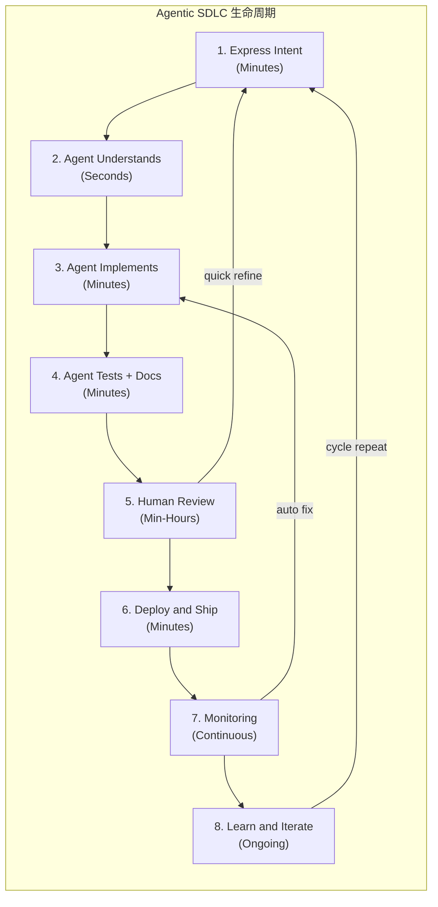
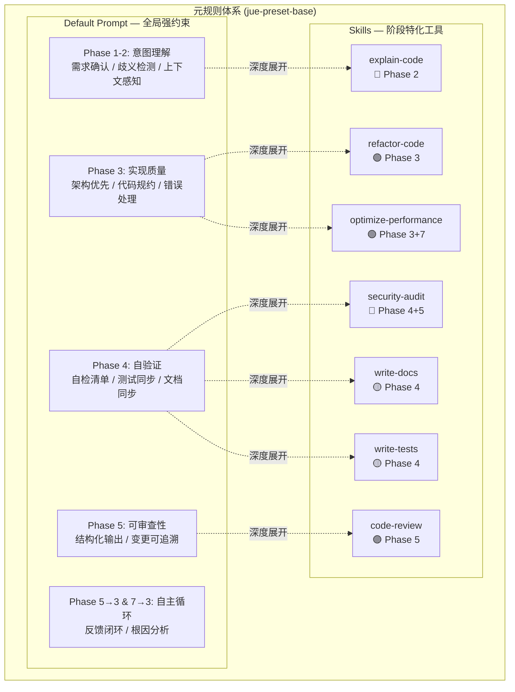

# jue-preset-base 重构：基于 Agentic SDLC 的元规则体系

## 核心理念

> [!IMPORTANT]
> **元规则的终极目标**：让 Human Review 阶段的改动趋近于零。
> AI 不仅要"做对"，还要"做到位"——代码结构、设计实现、工程优化、需求匹配、意图理解，全部在 Agent 自主循环中完成。

### 从 Traditional SDLC 到 Agentic SDLC

SDLC(Software Development Life Cycle 软件开发生命周期)



**关键差异**：

| 传统 SDLC | Agentic SDLC |
|-----------|--------------|
| 顺序交接 | 流式 Agent 流 |
| 人类写所有代码 | 人类引导，Agent 执行 |
| 文档是事后补充 | 文档内联生成 |
| 手动事件响应 | Agent 辅助修复 |

### 元规则的核心职责

元规则 = **强约束系统**，覆盖 Agentic SDLC 的每一个阶段，确保：

1. **意图理解零偏差**（Phase 1-2）：Agent 必须完全理解用户真实意图
2. **实现质量零妥协**（Phase 3）：代码结构、设计模式、工程质量达到生产标准
3. **自验证零遗漏**（Phase 4）：测试和文档自动生成，不依赖人类补充
4. **审查零改动**（Phase 5）：Human Review 时 AI 产出几乎不需要修改
5. **自主循环零阻塞**（Phase 5→3, 7→3）：AI 能自主修复和优化

## User Review Required

> [!WARNING]
> 本方案是对 `jue-preset-base` 的**根本性重设计**。不再是简单地"丰富每个 skill 的内容"，而是以 Agentic SDLC 为骨架，构建覆盖 AI 开发全生命周期的强约束体系。

> [!CAUTION]
> Default prompt 将从 6 行泛化原则升级为完整的元规则框架，是**破坏性变更**。所有 7 个 skill 也将围绕生命周期进行重构。

---

## Proposed Changes

### 一、Default Prompt — 元规则核心（覆盖全生命周期）

#### [MODIFY] [prompt.md](file://REPO_ROOT/packages/jue-preset-base/prompts/default/prompt.md)

从 6 行原则升级为 **Agentic SDLC 元规则框架**，按生命周期阶段组织：

**Phase 1-2: 意图理解与需求对齐**

- 意图解析协议：接收需求后必须先输出"需求理解确认"
- 歧义检测：遇到模糊需求时主动追问，禁止猜测
- 上下文感知：分析已有代码库的约定、风格、架构模式，保持一致性
- 范围确认：明确变更边界，避免过度设计或不足设计

**Phase 3: 实现质量强约束**

- 架构优先：先设计再编码，复杂变更需输出设计方案
- 代码规约：Clean Code + SOLID + KISS + DRY + YAGNI
- 错误处理：所有路径必须有完整的错误处理和边界保护
- 向后兼容：默认保持向后兼容，破坏性变更必须显式标注
- 小步快跑：每次变更应尽量小且可独立验证

**Phase 4: 自验证体系**

- 自检清单：实现完成后自动执行验证检查
- 测试覆盖：代码变更必须同步考虑测试影响
- 文档同步：公共 API 变更必须同步更新文档

**Phase 5: 可审查性设计**

- 结构化输出：变更需有清晰的 WHY → WHAT → HOW 叙述
- 变更可追溯：每个修改都需解释决策理由
- Diff 友好：输出格式便于 review，不做无意义的格式变动

**Phase 5→3 & 7→3: 自主循环**

- 反馈闭环：收到 review 反馈后快速定位并修复
- 根因分析：不治标治本，反馈暴露的是规则或理解的缺陷
- 渐进优化：每次循环都应提升后续产出质量

---

### 二、Skills — 生命周期特化工具

每个 skill 对应 Agentic SDLC 中的特定阶段，是元规则在该阶段的深度展开。

---

#### [MODIFY] [explain-code/prompt.md](file://REPO_ROOT/packages/jue-preset-base/skills/explain-code/prompt.md)

**定位：Phase 2 — Agent Understands（意图理解 & 知识传递）**

升级为代码理解方法论，帮助 AI 和人类快速理解现有代码：

- 业务优先原则：先讲 WHY（业务价值），再讲 HOW（技术实现）
- 分层分析：入口识别 → 执行链路追踪 → 数据流分析 → 副作用识别
- 可视化要求：关键逻辑用 Mermaid 时序图/流程图呈现
- 风险标注：识别性能热点、异常路径、隐式依赖

---

#### [MODIFY] [code-review/prompt.md](file://REPO_ROOT/packages/jue-preset-base/skills/code-review/prompt.md)

**定位：Phase 5 — Human Review（审查零改动的核心保障）**

升级为结构化审查框架，本质是"模拟 Human Review"：

- 审查维度矩阵：正确性 / 可读性 / 架构 / 性能 / 安全 / 可测试性
- 严重程度分级：🔴 Critical / 🟠 High / 🟡 Medium / 🟢 Low
- 标准化输出：问题表格（位置 / 描述 / 建议 / 严重程度）
- 验证清单：确保审查覆盖完整

---

#### [MODIFY] [refactor-code/prompt.md](file://REPO_ROOT/packages/jue-preset-base/skills/refactor-code/prompt.md)

**定位：Phase 3 — Agent Implements（实现质量保障 - 改进型）**

升级为结构化重构方法论：

- 代码异味检测清单：复杂度 / 耦合度 / 类型安全 / DRY 违规
- 重构建议矩阵：表格格式（位置 / 异味类型 / 重构手法 / 优先级）
- 重构计划：As-Is → To-Be → 安全验证步骤
- 硬约束：小步快跑、向后兼容、行为不变

---

#### [MODIFY] [optimize-performance/prompt.md](file://REPO_ROOT/packages/jue-preset-base/skills/optimize-performance/prompt.md)

**定位：Phase 3+7 — Agent Implements + Monitoring（性能持续保障）**

升级为结构化性能分析框架：

- 三层分析：运行时（算法/内存/并发）/ 网络（请求/缓存）/ 构建（产物体积）
- 性能热点矩阵：🔴 严重 / 🟡 中等 / 🟢 轻微
- 优化方案：含 Before/After 对比 + 预期收益 + 潜在风险
- 可量化验证：每项优化需提供验证方法

---

#### [MODIFY] [security-audit/prompt.md](file://REPO_ROOT/packages/jue-preset-base/skills/security-audit/prompt.md)

**定位：Phase 4+5 — Agent Tests + Human Review（安全质量门禁）**

升级为结构化安全审计框架：

- OWASP Top 10 对照扫描
- 风险评估矩阵：Impact × Likelihood
- 标准化漏洞报告：CWE 编号 / 复现路径 / 修复方案
- 安全编码检查清单

---

#### [MODIFY] [write-docs/prompt.md](file://REPO_ROOT/packages/jue-preset-base/skills/write-docs/prompt.md)

**定位：Phase 4 — Agent Tests + Docs（文档内联生成）**

升级为文档生成方法论——Agentic SDLC 下文档不是附属品，而是实现的一部分：

- 文档类型适配：API 文档 / 架构文档 / 使用指南
- 内容规范：JSDoc/TSDoc 完整规范 + 高质量示例
- 场景驱动结构：从用户场景出发组织文档
- 文档质量检查清单

---

#### [MODIFY] [write-tests/prompt.md](file://REPO_ROOT/packages/jue-preset-base/skills/write-tests/prompt.md)

**定位：Phase 4 — Agent Tests + Docs（自验证体系核心）**

升级为测试工程方法论——自验证是 Agentic SDLC 的关键闭环：

- 测试策略：测试金字塔（Unit → Integration → E2E）
- 用例设计：等价类划分 + 边界值分析 + 异常路径
- Mock/Stub 策略指南
- 覆盖率 + 质量检查清单

---

**说明**：每个文件的 `prompt.en.md` 将同步更新为对应的英文版本。

## 设计总览



## Verification Plan

### 自动验证

```bash
# 1. 确认所有文件存在且非空
find packages/jue-preset-base -name "prompt.md" -o -name "prompt.en.md" | xargs wc -l

# 2. 构建验证
cd packages/jue-preset-base && npm run build

# 3. 使用 jue apply 生成配置并检查内容
cd /tmp/test-project && npx jue apply
```

### 结构验证

- [ ] Default prompt 涵盖全部 5 个生命周期阶段
- [ ] 每个 skill 明确标注其对应的 Agentic SDLC 阶段
- [ ] 所有 skill 内容与 default prompt 的对应阶段形成"总 → 分"关系
- [ ] 所有 prompt 保持语言无关性（不绑定特定框架）
- [ ] 中英文版本内容对齐

### 效果验证

- [ ] 用一个真实代码片段测试 code-review skill，验证输出是否符合结构化模板
- [ ] 用 `AI_JUE_LANG=en` 验证英文版内容质量
- [ ] 验证 default prompt 的"意图确认"约束是否在实际对话中生效
