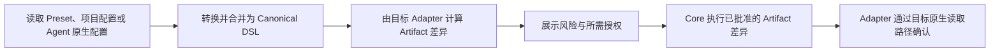

# Jue 架构

Jue 解决一件事：**定义一次能力，适配所有 Agent。**

它把项目能力整理为统一的 Canonical DSL，再由目标 Agent 的 Adapter 生成原生
Artifact。架构只定义六个稳定概念：

| 概念 | 唯一职责 |
| --- | --- |
| Capability | 描述一项可被 Agent 使用的通用能力 |
| Preset | 聚合、组合和分发一组 Capability |
| Canonical DSL | 表达目标无关的能力，是正反转换的唯一中间层 |
| Extension | 向 Jue 增加实现的统一机制 |
| Adapter | Extension 内针对一个 Agent 实现正反转换的内部单元 |
| Artifact | Adapter 为目标 Agent 生成或维护的原生产物 |

Agent、Plugin、Bundle、配置文件是外部世界中的对象或 Artifact 形态，不增加 Jue
概念。读取、校验、比较、写入和验收是执行动作，也不增加架构概念。

## 1. 最小转换模型

所有场景使用同一模型：

```text
Capability / Preset / Agent 原生配置
                    ↕
              Canonical DSL
                    ↕
                 Adapter
                    ↕
                 Artifact
```

- 从 Agent 导入时，Adapter 将其原生配置转换为 Canonical DSL。
- 向 Agent 输出时，Adapter 将 Canonical DSL 转换为一个或多个 Artifact。
- Agent A 到 Agent B 的迁移经过 Canonical DSL。
- Extension 负责注册 Adapter；它不改变转换模型。

Canonical DSL 既是规范，也是规范化后的数据表示；图关系直接表达为 DSL 数据。

## 2. 六个概念的边界

### 2.1 Capability

Capability 描述“Agent 能做什么”，而不是“文件放在哪里”。当前公共类型为
`skills`、`agents`、`commands`、`rules`、`hooks` 和 `mcp.servers`。

只有在至少两个 Agent 中具有稳定、相近语义的类型才能进入公共模型。某个 Agent
独有的设置由对应 Adapter 处理，不应伪装为通用 Capability。

### 2.2 Preset

Preset 是声明式 Capability 集合。它可以组合其他 Preset，但不负责选择目标
Agent、安装 Plugin，也不会在 Jue 解析阶段执行所携带的脚本。Preset 可以包含
由目标 Agent 在运行期使用的 hook 或 skill script；这类内容生成 Artifact 前
必须展示执行风险和授权要求。Preset 包与 Extension 包保持独立信任边界。

### 2.3 Canonical DSL

Canonical DSL 是唯一语义事实源，负责：

- 表达 Capability 及其依赖关系；
- 合并 Preset 与项目覆盖；
- 标记来源、所有权和可移植性；
- 为所有 Adapter 提供相同输入和输出合同。

Canonical DSL 不包含目标目录布局、安装状态或运行时权限。无法跨 Agent 表达的
原生字段不获得新的公共术语；Adapter 在同一目标的更新中原样保留未托管字段，
不得把它们带到其他 Agent。

项目配置不是 Canonical DSL。Preset、外部 Capability 引用和项目内联公共字段是
Canonical 输入；Target、Extension、Artifact 选择和 `tools.<target>` 是转换环境。
Core 在规范化前分离两者，Adapter 以 Canonical DSL 和当前目标配置作为两个独立
输入，目标私有字段不得进入 Canonical 的合并、可移植性或往返判断。

### 2.4 Extension

Extension 是唯一可执行扩展机制。Core 发现并加载受信任的 Extension，Extension
通过稳定 API 注册一个或多个 Adapter。未来出现新的 Agent 形态时，仍通过
Extension 扩展。

### 2.5 Adapter

Adapter 是 Extension 内部面向某个 Agent 的完整转换单元。它至少回答：

1. 这个 Agent 支持哪些 Canonical Capability；
2. 如何读取其原生配置并得到 Canonical DSL；
3. 如何把 Canonical DSL 转换为 Artifact 差异；
4. 如何读取目标原生状态并确认结果。

实现可以拆分函数和模块，但这些实现细节不进入公共术语表。
Adapter 不直接执行文件写入、删除、安装、联网或进程动作。Core 只执行用户批准的
精确 Artifact 差异，统一实施路径、权限、原子性和审计约束。

### 2.6 Artifact

Artifact 是目标 Agent 实际消费的产物，例如配置文件、目录、Plugin、Bundle 或
Archive。同一 Preset 面向不同 Agent 可以生成完全不同的 Artifact。

Plugin 因此不是 Capability，也不是 Jue Extension。它只是某些 Agent 的 Artifact
形态；其中可以承载一组 Capability，也可能包含 manifest、可执行代码和安装要求。

## 3. 执行语义

`jue apply` 对上述转换执行一个完整闭环：



这些步骤是一次 `apply` 的内部阶段，不要求用户学习相同数量的命令。

- `jue apply --dry-run` 只展示将发生的变化。
- `jue apply` 写入并确认结果。
- `jue apply --check` 不写入；配置无效、存在漂移或无法完成所需确认时失败。
- `jue inspect` 用于需要追踪解析结果、Adapter 或 Artifact 的高级诊断。

## 4. 正反转换与保留规则

对 Adapter 声明支持的公共语义，应满足：

```text
normalize(read(write(Canonical))) = normalize(Canonical)
```

跨 Agent 迁移只承诺 Canonical DSL 能表达且目标 Adapter 支持的部分。每项结果必须
明确为：

| 状态 | 含义 |
| --- | --- |
| `portable` | 可保持语义迁移 |
| `transformed` | 已转换为目标中的等价表达 |
| `degraded` | 目标只能表达部分语义 |
| `unsupported` | 目标没有等价表达 |
| `blocked` | 输入、安全、权限或环境阻止执行 |

同一目标已有但不归 Jue 管理的合法字段必须保留；这些字段不得跨目标传播。任何
降级、忽略或覆盖都必须在写入前可见。

## 5. 安全、幂等和完成标准

- Jue 解析 Preset 时不执行其内容；Extension 是 Jue 进程内代码；Agent Plugin
  是目标运行时 Artifact。三者按实际执行时机分别授权。
- 凭据只能被引用，不得进入 Canonical DSL、lock、日志或测试夹具。
- 安装依赖、联网、启动进程和用户级写入必须显式展示并授权。
- 相同 Canonical DSL、Adapter 版本和用户配置必须收敛到相同 Artifact。
- 生成文件不等于完成；Adapter 必须使用目标 Agent 可识别的路径确认结果。
- 目标无法提供确认路径时，结果必须是未确认，而不是成功。

## 6. 扩展一个 Agent

新增 Agent 支持只需要：

1. 定义该 Agent 支持的 Capability 映射；
2. 在一个 Adapter 中实现原生配置与 Canonical DSL 的双向转换；
3. 定义所生成的 Artifact 差异、风险和所需授权；
4. 添加往返、幂等、未托管字段保留和目标确认测试；
5. 通过 Extension 注册 Adapter；
6. 更新对应 [Agent 支持画像](../agents/) 和
   [Developer 实现状态](../developer/implementation-status.md)。

接口与验收细节见 [Adapter 标准](./adapter-standardization.md) 和
[Extension API](../reference/extension-api.md)。架构文档描述目标合同，Developer
文档描述当前差距；规划能力不得被写成已经实现。
