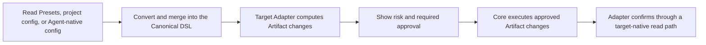

# Jue Architecture

Jue solves one problem: **define capabilities once, adapt them to every Agent.**

It normalizes project capabilities into one Canonical DSL, then lets the target
Agent Adapter produce native Artifacts. The architecture defines exactly six
stable concepts:

| Concept | Sole responsibility |
| --- | --- |
| Capability | Describe a reusable ability an Agent can use |
| Preset | Aggregate, compose, and distribute Capabilities |
| Canonical DSL | Provide the only intermediate representation for both directions |
| Extension | Add executable implementations to Jue |
| Adapter | Implement one Agent's bidirectional conversion inside an Extension |
| Artifact | Represent output produced or maintained for a target Agent |

Agent, Plugin, Bundle, and config file are external objects or Artifact forms.
Read, validate, compare, write, and confirm are execution actions. None adds a
Jue concept.

## 1. Minimal conversion model

Every scenario uses one model:

```text
Capability / Preset / Agent-native config
                    ↕
              Canonical DSL
                    ↕
                 Adapter
                    ↕
                 Artifact
```

- Import: an Adapter converts Agent-native config into the Canonical DSL.
- Export: an Adapter converts the Canonical DSL into one or more Artifacts.
- Agent A to Agent B still passes through the Canonical DSL.
- An Extension registers Adapters.

The Canonical DSL is both the specification and its normalized data
representation; relationships are expressed directly as DSL data.

## 2. Boundaries of the six concepts

### 2.1 Capability

A Capability describes what an Agent can do, not where a file is stored. Public
types are `skills`, `agents`, `commands`, `rules`, `hooks`, and `mcp.servers`.
A type enters the public model only after at least two Agents share stable,
similar semantics. Agent-specific settings remain inside that Agent's Adapter.

### 2.2 Preset

A Preset is a declarative Capability collection. It may compose other Presets,
but it does not choose an Agent or install a Plugin, and Jue does not execute
its scripts while resolving it. A Preset may carry hooks or skill scripts that
the target Agent executes later; their execution risk and required approval
must be visible before Artifact generation. Preset and Extension packages
remain separate trust boundaries.

### 2.3 Canonical DSL

The Canonical DSL is the sole semantic source of truth. It expresses
Capabilities and relationships, merges Presets and project overrides, records
origin and ownership, and gives every Adapter one contract.

It contains no target directory layout, install state, or runtime permission.
For Agent-native fields that cannot be portable, the Adapter preserves
unmanaged fields during same-target updates without exporting them to another
Agent.

Project configuration is not the Canonical DSL. Presets, external Capability
references, and inline public fields are Canonical inputs. Target, Extension,
Artifact selection, and `tools.<target>` are conversion environment. Core
separates them before normalization, and an Adapter receives Canonical data and
target configuration as distinct inputs.

### 2.4 Extension

An Extension is the only executable extension mechanism. Core loads trusted
Extensions, and an Extension registers one or more Adapters through the stable
API. New Agent forms use the same mechanism.

### 2.5 Adapter

An Adapter is the complete conversion unit for one Agent inside an Extension.
It states supported Capabilities, reads native config into the Canonical DSL,
computes Artifact changes, and confirms the result from target-native state.
It does not execute writes, deletion, installation, network, or process
actions. Core executes only the exact approved Artifact changes and enforces
path, permission, atomicity, and audit constraints.

### 2.6 Artifact

An Artifact is output consumed by the target Agent: config, directory, Plugin,
Bundle, or Archive. The same Preset may produce different Artifacts per Agent.
A Plugin is therefore not a Capability or a Jue Extension; it is an Artifact
form that may carry Capabilities, a manifest, executable code, and install
requirements.

## 3. Execution semantics

`jue apply` runs the complete loop:



These are internal stages of one `apply`, not commands users must memorize.

- `jue apply --dry-run` shows changes only.
- `jue apply` writes and confirms.
- `jue apply --check` does not write and fails on invalid input, drift, or
  unavailable required confirmation.
- `jue inspect` provides advanced diagnostics for resolution, Adapters, and
  Artifacts.

## 4. Bidirectional conversion and preservation

For supported public semantics:

```text
normalize(read(write(Canonical))) = normalize(Canonical)
```

Cross-Agent migration promises only what the Canonical DSL can express and the
target Adapter supports. Each result is classified as `portable`,
`transformed`, `degraded`, `unsupported`, or `blocked`.

Valid target fields not managed by Jue survive same-target updates and never
propagate to another target. Degradation, omission, and overwrite are visible
before writing.

## 5. Safety, idempotency, and completion

- Jue does not execute Preset content while resolving it. Extensions are code
  in the Jue process, while Agent Plugins are target-runtime Artifacts. Each is
  approved according to when and where execution occurs.
- Credentials are referenced only and never enter Canonical data, locks, logs,
  or fixtures.
- Dependency installation, network access, processes, and user-level writes
  require visible approval.
- Identical Canonical DSL, Adapter version, and user config converge to the same
  Artifacts.
- File generation is not completion; the Adapter confirms through a path the
  Agent recognizes.
- Missing confirmation produces an unconfirmed result, never success.

## 6. Extending an Agent

To add an Agent:

1. map the Capabilities it supports;
2. implement native-config ↔ Canonical DSL conversion in one Adapter;
3. define Artifact changes, risks, and required approvals;
4. test round trips, idempotency, unmanaged-field preservation, and native
   confirmation;
5. register the Adapter through an Extension;
6. update the [Agent support profile](../agents/) and
   [implementation status](../developer/implementation-status.md).

See the [Adapter standard](./adapter-standardization.md) and
[Extension API](../reference/extension-api.md). Architecture states the target
contract; Developer docs state current gaps.
