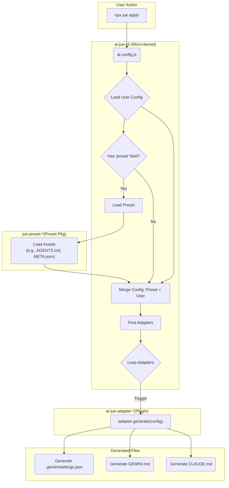

# Architecture & Execution Flow

The core design philosophy of `ai-jue` is "Micro-kernel + Plugins". This architecture ensures core stability and powerful extensibility, allowing the community to easily add support for new AI tools.

This document will delve into the overall execution flow of `ai-jue`, helping developers better understand its internal working principles.

## Core Execution Flowchart

When a user runs `npx jue apply` in the terminal, a series of operations occur internally, as shown below:

## Detailed Flow

1. **Load User Config**
    * `ai-jue-cli` first uses `cosmiconfig` to find and load the user's configuration file in the project root, typically `ai.config.js`.
    * This user configuration defines the basic requirements of the project, such as which `preset` to use, and any custom configuration that needs to override the preset.

2. **Load Preset**
    * If the user configuration specifies a `preset` (e.g., `preset: 'internal'`), the CLI looks for the corresponding npm package (e.g., `jue-preset-internal`) in `node_modules`.
    * Once the preset package is found, the CLI's loader begins to **scan the file system of the preset package** (since our presets are "build-free" collections of pure files).
    * It looks for directories and files like `AGENTS.md`, `skills/`, `tools/` based on the preset directory specification.
    * During the lookup, it applies our defined **i18n strategy**: If the user configured `language` in `ai.config.js`, it prioritizes finding files with language suffixes (like `AGENTS.zh-CN.md`); if not found, it falls back to finding the default file without a suffix (`AGENTS.md`).
    * Finally, the loader assembles all found assets (prompts, skills, tools, etc.) into a structured "Preset Configuration Object".

3. **Merge Configs**
    * This is a critical step to ensure user configuration has the highest priority.
    * `ai-jue-cli` performs a **Deep Merge**, **overwriting** the user configuration object (`ai.config.js`) onto the configuration object loaded from the preset.
    * For example, if both the preset and the user configuration define `tools.gemini`, the version in the user configuration will be used.

4. **Find & Loop Adapters**
    * After configuration merging is complete, the CLI scans `node_modules` for all installed adapters (plugins) that follow the `ai-jue-adapter-*` naming convention.
    * It iterates through all found adapters and calls the `generate(config, outputDir)` function exposed by each adapter, passing the final merged `finalConfig` object to it.

5. **Generate Files**
    * Each adapter, in its own `generate` function, extracts the parts it cares about from the passed `config` object.
    * For example, `ai-jue-adapter-gemini` looks for `config.prompts.agents` (or `config.prompts.gemini`) and `config.tools.gemini`.
    * It then generates corresponding files (like `GEMINI.md` and `.gemini/settings.json`) in the project root (`outputDir`) based on these configurations.
    * When writing files, the adapter follows the "**Smart Coexistence**" strategy, updating only the blocks or fields it manages, never destroying manual modifications by the user.

Through this process, `ai-jue` achieves a highly decoupled, extensible, and user-friendly configuration management workflow.
