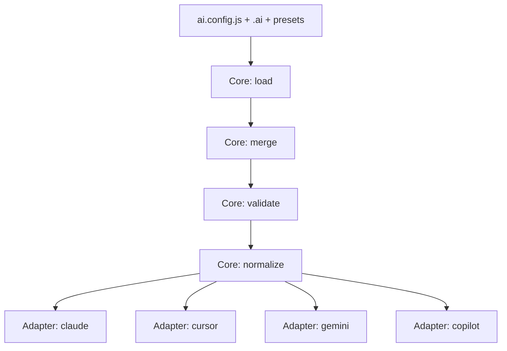

# Architecture & Execution Flow

`ai-jue` uses a "micro-kernel + adapters" architecture:

- Core: load config/assets, merge, validate, dispatch adapters
- Adapters: convert the canonical capability model into tool-specific outputs

## 1. User Consumption Path (Begin with the End)

1. Users organize `.ai/` assets and `ai.config.js` using canonical conventions
2. Core resolves a canonical capability model
3. Adapters perform format conversion only

## 2. Core Flow



## 3. Canonical Capability Model (Single)

- `AGENTS.md` (global context)
- `rules`
- `commands`
- `skills`
- `agents`
- `hooks`
- `mcp`
- `tools/<tool>`

## 4. Directory Protocol

Preset structure and `.ai` structure are isomorphic:

```text
AGENTS.md
skills/
commands/
rules/
agents/
hooks/
tools/
```

## 5. Merge Priority

Default priority (low -> high):

1. preset assets
2. local `.ai` assets
3. explicit `extends`
4. direct `ai.config.js` overrides

## 6. Non-Canonical Input Policy

- Fail fast on non-canonical capability fields
- Return actionable repair guidance
- Do not implement legacy-field compatibility in adapters

## 7. Design Gate (Before Implementation)

For complex changes, complete these first:

- User-facing docs updates (`README` / guides)
- Design docs updates (architecture / adapter spec)
- Review approval

Then implement with:

- Architecture-first design
- Small independently verifiable steps
- Full error and boundary handling
