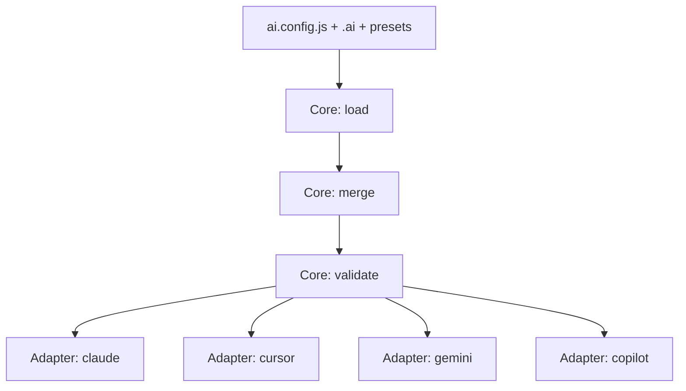

# 架构与运行流程

`ai-jue` 采用“微内核 + 适配器”架构：

- 微内核负责：加载配置、合并资产、执行校验、调度适配器
- 适配器负责：把统一能力模型转换为目标工具产物

## 1. 核心流程



## 2. 统一能力模型

核心模型统一为 8 类能力：

- `AGENTS.md`（全局上下文）
- `rules`
- `commands`
- `skills`
- `agents`
- `hooks`
- `mcp`
- `tools/<tool>`

## 3. 目录协议

Preset 与 `.ai` 目录同构：

```text
AGENTS.md
skills/
commands/
rules/
agents/
hooks/
tools/
```

## 4. 配置合并优先级

默认优先级（低 -> 高）：

1. preset 资产
2. `.ai` 本地资产
3. `extends` 显式引入
4. `ai.config.js` 直接配置

## 5. 兼容与迁移策略

- 规范字段：`agents`
- 兼容别名：`subAgents`
- 迁移策略：先提供双读兼容，再统一写入，再清理旧字段

## 6. 设计门禁（实施前）

复杂改动必须先完成：

- 用户侧文档更新（README/guide）
- 设计文档更新（架构/适配规范）
- 评审确认通过

通过后再进入实现阶段，且遵循：

- 架构优先
- 向后兼容优先
- 小步可验证
- 全路径错误处理
