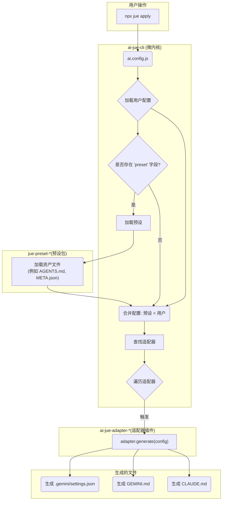

# 架构与运行流程

`ai-jue` 的核心设计理念是“微内核 + 插件化”。这套架构保证了核心的稳定性和强大的可扩展性，让社区能够轻松地为其添加对新 AI 工具的支持。

本篇文档将深入讲解 `ai-jue` 的整体运行流程，帮助开发者更好地理解其内部工作原理。

## 核心运行流程图

当用户在终端运行 `npx jue apply` 时，内部会发生以下一系列操作，如下图所示：

## 流程详解

1. **加载用户配置 (Load User Config)**
    * `ai-jue-cli` 首先会使用 `cosmiconfig` 在项目根目录查找并加载用户的配置文件，最常见的是 `ai.config.js`。
    * 这个用户配置文件定义了项目的基本需求，例如要使用哪个预设 (`preset`)，以及任何需要覆盖预设的自定义配置。

2. **加载预设 (Load Preset)**
    * 如果用户配置中指定了 `preset`（例如 `preset: 'internal'`），CLI 会在 `node_modules` 中查找对应的 npm 包（例如 `jue-preset-internal`）。
    * 找到预设包后，CLI 的加载器会开始**扫描该预设包的文件系统**（因为我们的预设是“无构建”的纯文件集合）。
    * 它会根据预设的目录规范，查找 `AGENTS.md`, `skills/`, `tools/` 等目录和文件。
    * 在查找过程中，它会应用我们定义的 **i18n 策略**：如果用户在 `ai.config.js` 中配置了 `language`，它会优先查找带语言后缀的文件（如 `AGENTS.zh-CN.md`），如果找不到，则回退到查找无后缀的默认文件（`AGENTS.md`）。
    * 最终，加载器将所有找到的资产（prompts, skills, tools 等）组装成一个结构化的“预设配置对象”。

3. **配置合并 (Merge Configs)**
    * 这是确保用户配置拥有最高优先级的关键一步。
    * `ai-jue-cli` 会执行一次**深度合并 (Deep Merge)**，将用户配置对象 (`ai.config.js`) **覆盖**到从预设加载的配置对象之上。
    * 例如，如果预设和用户配置都定义了 `tools.gemini`，最终会采用用户配置中的版本。

4. **发现并执行适配器 (Find & Loop Adapters)**
    * 在配置合并完成后，CLI 会扫描 `node_modules`，查找所有已安装的、遵循 `ai-jue-adapter-*` 命名约定的适配器（插件）。
    * 它会遍历所有找到的适配器，并依次调用每个适配器暴露出的 `generate(config, outputDir)` 函数，同时将最终合并好的 `finalConfig` 对象传递给它。

5. **文件生成 (Generate Files)**
    * 每个适配器在自己的 `generate` 函数中，会从传入的 `config` 对象中提取自己关心的部分。
    * 例如，`ai-jue-adapter-gemini` 会查找 `config.prompts.agents`（或 `config.prompts.gemini`）和 `config.tools.gemini`。
    * 然后，它会根据这些配置，在项目的根目录（`outputDir`）生成对应的文件（如 `GEMINI.md` 和 `.gemini/settings.json`）。
    * 在写入文件时，适配器会遵循“**智能共存**”策略，只更新它所管理的区块或字段，绝不破坏用户的手动修改。

通过这个流程，`ai-jue` 实现了一个高度解耦、可扩展、且对用户友好的配置管理工作流。
