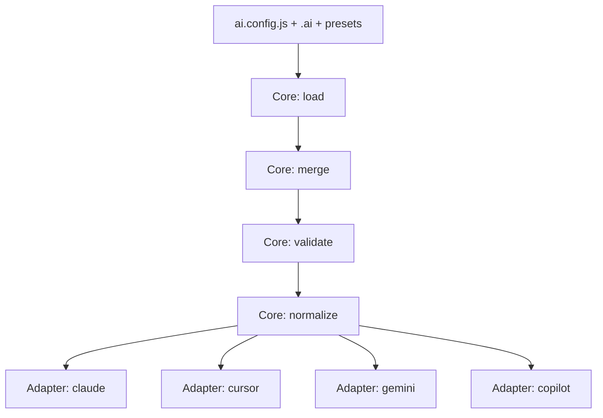

# 架构与运行流程

`ai-jue` 采用“微内核 + 适配器”架构：

- 微内核负责：加载配置、合并资产、执行校验、调度适配器
- 适配器负责：把统一能力模型转换为目标工具产物
- `ai-jue-core` 负责共享的文件输出、frontmatter 渲染、capability walker 等通用基础设施，避免适配器重复实现

## 0. 架构原则

先说结论：

`ai-jue` 的核心不是“生成几种工具文件”，而是先把不同来源的配置收敛成一套统一标准结构，再由适配器把这套结构转换成各工具文件。

为什么这样设计：

- 用户可以从 `ai.config.js`、`.ai/`、preset 三个入口提供能力
- 如果系统内部没有一套统一标准结构，不同入口和不同 adapter 就会逐渐漂移
- 一旦发生漂移，就会出现“配置合法，但某些工具产物不完整”的问题

因此整个架构遵循三条原则：

1. 用户入口可以有少量兼容写法，但进入核心流程后必须尽量收敛为同一结构
2. 适配器只负责“统一结构 -> 工具格式”的转换，不重复解释输入含义
3. 文档描述的目标如果暂时领先实现，必须显式标出差异，而不能让用户自己猜

### 0.1 第一原则：用户认知负荷最小

这是整个项目最重要的原则。

用户在使用 `ai-jue` 时，应该以尽量小的代价完成三件事：

1. 复用已有 AI 资产
2. 在不同工具之间迁移这些资产
3. 只学习少量稳定概念，而不是学习每个工具各自的内部细节

因此用户侧优先暴露的是主流实践已经存在的能力形态，例如：

- `AGENTS.md`
- `skills/`
- `commands/`
- `rules/`
- `hooks/`

而不是先要求用户理解内部桥接概念。

### 0.2 第二原则：内部转换成本要低

对内，系统要尽量把复杂度集中在“统一解析 + 适配器转换”两层，而不是把转换逻辑散落在每个入口或每个工具分支里。

这意味着：

- core 负责把不同来源的输入收敛为统一结构
- adapter 负责把统一结构映射到各工具原生产物
- 同类输出逻辑优先沉淀到共享层，而不是在 adapter 中平行复制

只有这样，新增一个 adapter 的代价才会足够小。

### 0.3 第三原则：正反向转换都要低成本

`ai-jue` 不是只做“从 `.ai/` 生成工具文件”的单向系统，也要支持把存量工具配置低成本翻转回统一资产。

因此架构要同时服务两类路径：

1. 正向路径：`.ai/` / `ai.config.js` / preset -> `.claude` / `.cursor` / `.gemini` / `.github`
2. 反向路径：`.claude` / `.cursor` / `.gemini` 等存量配置 -> `.ai/` 与 `ai-jue` 可管理资产

这也是 `jue format` 存在的原因：  
它不是附属功能，而是“降低用户迁移成本”的核心一环。

### 0.4 第四原则：保留逃生舱，但不破坏整体简洁

系统默认优先使用统一能力目录和统一字段，减少用户心智负担。

但不同工具仍然存在不可避免的原生差异，因此需要保留 escape hatch：

- `tools.<tool>`
- `tools/<tool>/config.json`
- adapter 内显式降级说明

逃生舱的目的不是鼓励用户绕开统一结构，而是：

- 在主流能力之外保留扩展空间
- 让系统在面对工具差异时保持可用
- 同时不把这些差异反向污染到用户的主流使用路径

### 0.5 这套原则如何支撑后续扩展

这套架构原则主要服务两类扩展：

1. 扩展新的 adapter
2. 扩展新的通用能力

扩展新的 adapter 时：

- 只要 adapter 消费统一结构，就不需要重新定义用户输入模型
- 新 adapter 的成本主要落在“结构 -> 工具格式”的映射层

扩展新的通用能力时：

- 先定义该能力是否足够通用、是否符合最小认知负荷
- 再决定是否进入统一结构
- 如果只是单工具私有能力，优先放在逃生舱而不是直接提升为统一能力

### 0.6 通用能力的下沉链路

为了避免工具私有能力直接污染用户输入模型，新增能力应遵循一条逐步下沉的演进路径：

1. **单工具试验阶段**
   - 新能力先留在 adapter 内部或 `tools.<tool>` 逃生舱
   - 目标是先验证这个能力是否真实有价值，而不是立刻提升为统一能力

2. **多工具复用阶段**
   - 当第二个、第三个工具也需要相近能力时，先在 adapter 层对齐命名和语义
   - 这时仍优先通过“约定大于配置”的方式复用现有结构，避免立刻扩用户输入

3. **统一能力下沉阶段**
   - 只有当该能力已经足够稳定、足够通用、且不会显著增加用户认知负担时，才下沉到 core
   - 下沉后再补齐：
     - schema 支持
     - normalize 统一结果
     - preset / `.ai` 目录协议
     - adapter 映射与降级策略
     - contract tests

判断标准：

- 是否至少有两个工具具备近似语义
- 是否能用用户容易理解的主流概念表达
- 是否值得成为团队长期复用资产，而不只是单次工具特性
- 是否能在不明显增加心智负担的前提下进入统一结构

如果答案是否定的，就应继续停留在 adapter 或逃生舱层，而不是过早进入 core

## 1. 用户消费路径（以终为始）

1. 用户按规范组织 `.ai/` 与 `ai.config.js`
2. 系统统一解析为规范能力模型
3. 适配器仅做目标格式转换并输出文件

补充：

- 已有 `.claude` / `.cursor` / `.gemini` 等配置的项目，可以先通过 `jue format` 低成本收敛回 `.ai/`
- 新项目则直接从 `.ai/` 与 `ai.config.js` 出发，再分发到各工具

## 2. 核心流程



## 3. 统一能力模型（唯一）

- `AGENTS.md`（全局上下文）
- `rules`
- `commands`
- `skills`
- `agents`
- `hooks`
- `mcp`
- `tools/<tool>`

说明：

- 本文档中的“统一能力模型”分为两层：
  - 当前实现事实：由 `config.ts -> resolver.ts -> normalize.ts -> adapters` 共同定义
  - 目标协议：后续希望继续收口为更稳定的统一标准结构
- 如果两者不一致，以当前代码实现为第一信息源，并把差异显式记录为待收口项

### 3.1 normalize 后的统一结果约束

适配器必须消费 normalize 后的统一结构，而不是各自猜测输入形状：

- `rules`：以 `content` 为规范正文，允许兼容输入 `prompt`
- `commands`：以 `prompt` 为规范正文，兼容 `content -> prompt`
- `skills`：`prompt` 与 `content` 在 normalize 后保持镜像
- `agents`：`prompt` 与 `content` 在 normalize 后保持镜像
- `hooks`：当前实现会保留 `string | object | array` 三类形状，不在 normalize 阶段压平成字符串
- `mcp.servers`：保留 `scope/disabled/autoApprove` 等字段，交由适配器决定原生映射或显式降级

当前待收口差异：

- `prompts` 尚未在 normalize 层做 `prompt/content` 镜像统一，不同 adapter 的消费形状仍有差异
- `commands` 当前 schema 允许缺失 `prompt/content`，但 adapter 实际仍依赖 `prompt`
- `hooks` 当前 schema 接受 array，但并非所有 adapter 都原生支持同一 array 语义

## 4. 目录协议

Preset 与 `.ai` 目录同构：

```text
AGENTS.md
skills/
commands/
rules/
agents/
hooks/
tools/
```

当前实现说明：

- `commands/*/prompt.md` 已是正式消费路径
- `skills/*/SKILL.md` 已是正式消费路径
- `agents/*/(prompt.md|AGENTS.md)` 已被 loader 消费
- `hooks/*` 当前仍主要被解释为脚本型输入，目录协议尚未完全升级到结构化 hooks
- `tools/<tool>/config.json` 是当前 loader 唯一正式读取的工具目录配置入口

设计含义：

- 统一目录协议优先服务“最低心智成本”
- 目录协议之外的工具差异优先通过工具私有配置入口承载
- 只有当某个能力足够稳定、足够通用时，才应提升为统一能力

## 4.1 共享适配基础设施约束

- `generateMarkdownFile` / `generateJsonFile` 负责智能共存与 JSON 深合并
- `ensureDir` / `writeTextFile` / `writeSupportFiles` 负责稳定的目录与资产输出
- `getAssetText` / `getRecordEntries` 负责统一资产读取与 object walker
- `renderMarkdownWithFrontmatter` / `renderBulletSection` 负责跨适配器一致的 Markdown 片段渲染
- 共享 helper 必须优先沉淀到 `ai-jue-core`，不允许 Claude/Cursor/Copilot 长期各自复制同一套逻辑

## 5. 配置合并优先级

默认优先级（低 -> 高）：

1. preset 资产
2. `.ai` 本地资产
3. `extends` 显式引入
4. `ai.config.js` 直接配置

### 5.1 `AGENTS.md` 特殊合并规则（嵌套 preset 场景）

`AGENTS.md` 为文本型全局上下文，不采用“覆盖替换”，采用“分层追加”：

1. 嵌套 preset 依赖链（先依赖、后当前 preset）
2. `.ai/AGENTS.md`（若存在）
3. 项目根 `AGENTS.md`（若存在）
4. `ai.config.js` 中 `context.global`（若显式提供）

规则：

- 按上述顺序拼接为最终 `context.global`
- 越靠后层级优先级越高（更贴近当前项目/用户意图）
- 结构化能力（`rules/commands/skills/hooks/agents/mcp/tools`）仍采用对象深合并，后者覆盖前者

实现约束：

- layered context merge 必须在共享函数中实现
- 不允许 preset/resolver 各自维护分叉逻辑

## 6. 非规范输入策略

- 检测到非规范能力字段直接失败
- 返回可执行修复建议
- 不在适配器层处理非规范字段

当前实现边界：

- “未知 top-level capability” 已 fail-fast
- 但部分“结构合法但语义不完整”的输入仍会进入 adapter，例如缺失正文的 command
- 因此下一轮收口重点不是继续扩字段，而是收紧统一标准结构

## 7. 设计门禁（实施前）

复杂改动必须先完成：

- 用户侧文档更新（README/guide）
- 设计文档更新（架构/适配规范）
- 评审确认通过

通过后再进入实现阶段，且遵循：

- 架构优先
- 小步可验证
- 全路径错误处理
