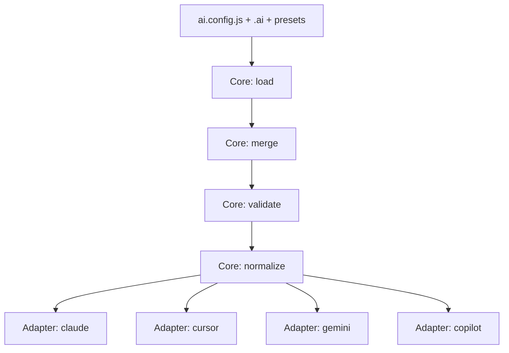

# 架构与运行流程

`ai-jue` 采用“微内核 + 适配器”架构：

- 微内核负责：加载配置、合并资产、执行校验、调度适配器
- 适配器负责：把统一能力模型转换为目标工具产物

## 1. 用户消费路径（以终为始）

1. 用户按规范组织 `.ai/` 与 `ai.config.js`
2. 系统统一解析为规范能力模型
3. 适配器仅做目标格式转换并输出文件

## 2. 核心流程



## 3. 统一能力模型（唯一）

- `AGENTS.md`（全局上下文）
- `rules`
- `commands`
- `skills`
- `agents`
- `hooks`
- `mcp`
- `tools/<tool>`

## 4. 目录协议

Preset 与 `.ai` 目录同构：

```text
AGENTS.md
skills/
commands/
rules/
agents/
hooks/
tools/
```

## 5. 配置合并优先级

默认优先级（低 -> 高）：

1. preset 资产
2. `.ai` 本地资产
3. `extends` 显式引入
4. `ai.config.js` 直接配置

### 5.1 `AGENTS.md` 特殊合并规则（嵌套 preset 场景）

`AGENTS.md` 为文本型全局上下文，不采用“覆盖替换”，采用“分层追加”：

1. 嵌套 preset 依赖链（先依赖、后当前 preset）
2. `.ai/AGENTS.md`（若存在）
3. 项目根 `AGENTS.md`（若存在）
4. `ai.config.js` 中 `context.global`（若显式提供）

规则：

- 按上述顺序拼接为最终 `context.global`
- 越靠后层级优先级越高（更贴近当前项目/用户意图）
- 结构化能力（`rules/commands/skills/hooks/agents/mcp/tools`）仍采用对象深合并，后者覆盖前者

## 6. 非规范输入策略

- 检测到非规范能力字段直接失败
- 返回可执行修复建议
- 不在适配器层处理非规范字段

## 7. 设计门禁（实施前）

复杂改动必须先完成：

- 用户侧文档更新（README/guide）
- 设计文档更新（架构/适配规范）
- 评审确认通过

通过后再进入实现阶段，且遵循：

- 架构优先
- 小步可验证
- 全路径错误处理
